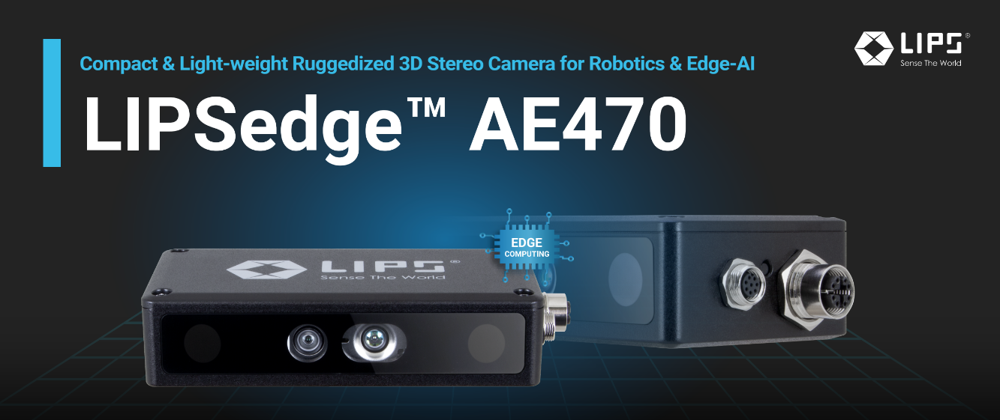
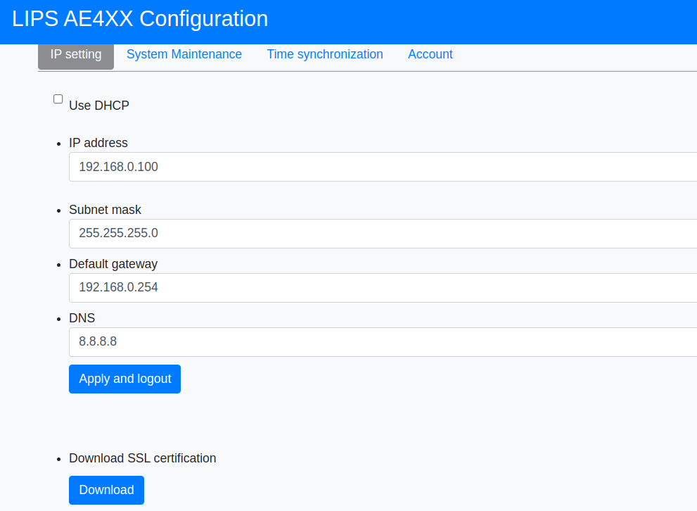
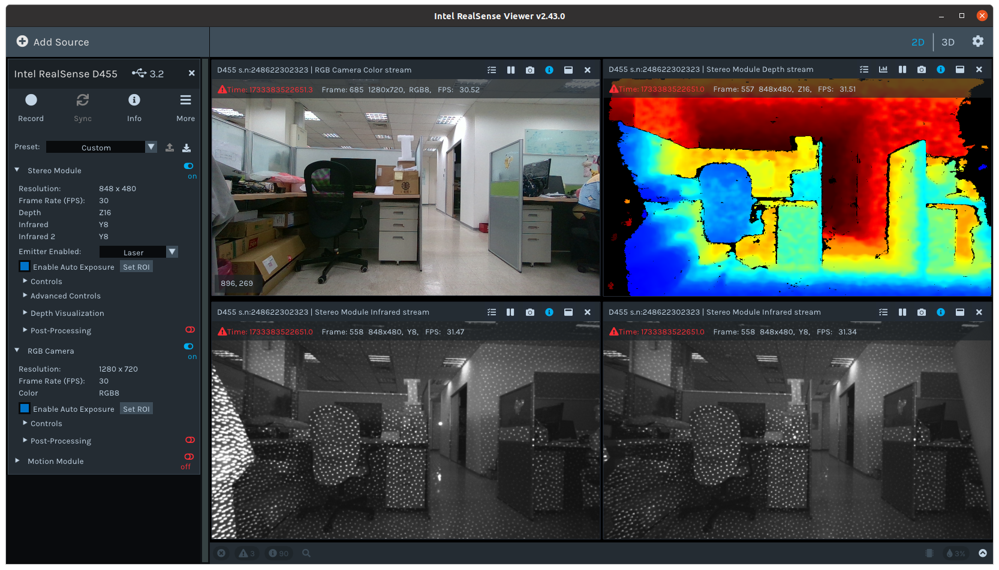

# LIPSedge™ AE470 Long-Range Industrial Stereo Camera
Compact & Light-weight Ruggedized 3D Stereo Camera for Robotics & Edge-AI with Enhanced Range


 - With less than 300 grams of weight, compact form factor.
 - GigE/PoE support and IP67 dust & water-proof.
 - Edge-AI SOC.
 - Applications require also long-range distances captures and detection, excellent for robotic hand-eye and factory automation.
 - [product info](https://www.lips-hci.com/lipsedge-ae470)
 - [product documents](https://lips-hci.gitbook.io/lips-developer-documentation/documents-installation-and-setup/lipsedge-tm-ae430-ae470)

# SDK Overview
This SDK is based on [Intel RealSense™ SDK](https://github.com/IntelRealSense/librealsense) [v2.43.0](https://github.com/IntelRealSense/librealsense/wiki/Release-Notes#release-2430) to assist you connect LIPSedge™ AE470/430 3D Cameras to your applications fast and easily. RealSense™ SDK already offers many tools, code examples, and software wrappers for integration with existing 3rd-party and software languagues.

## Build instruction for Ubuntu Linux
### Install dependencies
(Optional) Make Ubuntu up-to-date including the latest stable kernel:
```
$ sudo apt-get update && sudo apt-get upgrade && sudo apt-get dist-upgrade
```
Install the core packages required to build librealsense binaries and the affected kernel modules:
```
$ sudo apt-get install libssl-dev libusb-1.0-0-dev libudev-dev pkg-config libgtk-3-dev
```
Install build tools
```
$ sudo apt-get install git wget cmake build-essential
```
Prepare Linux Backend and the Dev. Environment
```
$ sudo apt-get install libglfw3-dev libgl1-mesa-dev libglu1-mesa-dev at
```
### Building SDK

Run CMake to configure this project and make release build.
```
$ mkdir build && cd build
$ cmake ../ -DCMAKE_BUILD_Type=Release
$ make -j4
```
Note: You can find more information about the available configuration options on this realsense [wiki page](https://github.com/IntelRealSense/librealsense/wiki/Build-Configuration).

Recompile and install SDK library (librealsense2 binaries):
```
$ sudo make uninstall && make clean && make && sudo make install
```

### Camera network configuration
Default camera IP address is 192.168.0.100. You have to modify it according to your network environment.

In your browser, type 'http://192.168.0.100/' to login to camera web-admin page and modify the IP address.


After new IP configuration saved. Try ping the camera to make sure it is connected to your network environment, or you can use tool lips-ae400-toolkit to scan LIPSedge AE4xx cameras.
```
$ lips-ae400-toolkit
Usage: ./lips-ae400-toolkit [-html: use your browser to open html]
Scanning your network to find AE4xx devices...
(this may take 10~20 secs)

====== Scan Result ======

IP address  = 192.168.0.100
Version     = v5.13.0.50.11
Description = LIPSedge AE4XX/2800TN0500051/3C:FA:D3:70:09:0A

====== Scan End    ======
```

### Setup network config
If you have installed the SDK, you can edit config file '/usr/local/bin/network.json' to specify how many camera you want to connect and their IP address.

```
{
    "count": "1",
    "config": {
        "ip1": "192.168.0.100",
        "ip2": "192.168.1.100",
        "connection_timeout": 900,
        "connection_timeout_help": "if exceeding this setting (seconds), we give up connecting to ip1,ip2,..., 0 means infinite trying"
    }
}
```

### Run realsense-viewer to view depth streaming
If you have installed the SDK, the tool 'realsense-viewer' was installed to '/usr/local/bin' so you can execute it in anywhere, or you can switch to the build folder to launch it locally.

In the build folder, SDK library 'librealsense2.so.2.43.0' is built ready, this means you can put your tool/application/sample binary and the config 'network.json' together inside the same folder to lanuch program.
(python wrapper library .pyd and librealsense2.so put together, you can run your python script) 

```
$ cd build
$ ln -s tools/realsense-viewer/realsense-viewer .
$ ln -s config/network.json .
$ ./realsense-viewer 
[readjson] configuration is found at network.json
[LIPSedge-AE430/470] Read local network config.

```
realsense-viewer screenshot



## Device Specifications
| Depth |                              |
| ----- | ---------------------------- |
|       | Technology : Active Stereo   |
|       | Baseline : 95mm |
|       | Max. Working Distance : 10+ m |
|       | Min. Working Distance : 0.52 m |
|       | Frame Rate : 1280 x 720 @ 30fps   |
|       | FoV (H x V x D) : 87° x 58° x 95° |
|       | Shutter Type : Global Shutter |
|       | Z Accuracy : ≤ 2% (up to 4 meters and 80% of FoV) <br> * accuracy will vary with disance |
| Illumination | Type : Infared |
|              | Pattern Type : Static |
|              | Wavelength : 850nm |
|              | Illumating Component : laser (VCSEL) |

-----

| Color |                                 |
| ----- | ------------------------------- |
|       | Resolution : 1280 x 800 @ 30fps |
|       | Shutter Type : Global Shutter   |
|       | FoV (H x V x D) : 87° x 58° x 95° |
-----

| Processor​ |              |
| ----- | ------------------------------- |
| CPU   | Quad Core ARM Corex-A73 <br> Dual Core Cortex A-53 CPU |
| GPU   | ARM Mali-G52 |
-----

| General​ |              |
| ------- | ------------------------------- |
|         | Dimension (mm) : 130 x 32 x 66 mm |
|         | Weight(g) : 280g (≤ 300g) |
|         | Storage Temperature : -40 ~ 70˚C |
|         | Ambient Temperature : 0 ~ 40˚C |
| Power   | PoE (IEEE 802.3 at/at) |
| Output Interfaces | M8 standard connector : Power wire (12V, 1A) <br> M12 connector : GigE cable for power and data |
| Accessories      | M12-to-RJ45 Cable is included |
| Others  | Built-In industrial heatsink |
|         | Built-in 6 axis IMU |
-----
